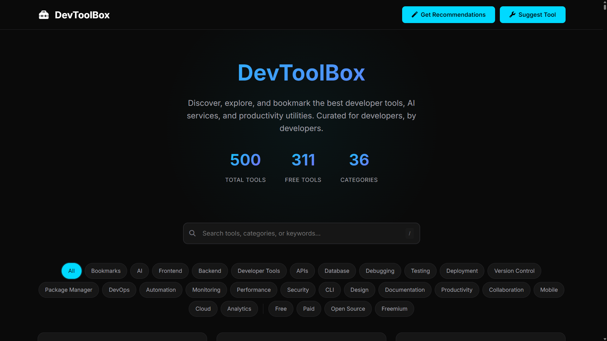
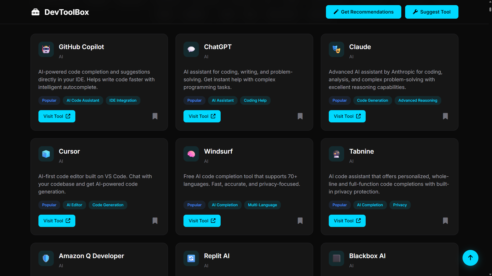

# 🧰 DevToolBox – Curated Developer Tools

DevToolBox is a modern web application that helps developers **discover, explore, bookmark, and get AI-powered recommendations** for the best tools, APIs, frameworks, and utilities.

It’s designed with **aesthetic UI, smooth interactivity, and AI integration** via Google Gemini to recommend the perfect tech stack based on your project needs and experience level.

---

## 🚀 Features

- **Search & Filters** – Search tools by name, category, or keyword with advanced filters (Free, Paid, Open Source, Freemium).
- **Bookmarks** – Save favorite tools to revisit anytime (stored in local storage).
- **AI Recommendations** – Describe your project, select experience level & project type, and get curated tool suggestions powered by Gemini.
- **Suggest Tools** – Submit new tools to the directory via an integrated form.
- **Dynamic Stats** – Real-time stats for total tools, free tools, and categories.
- **Modern UI** – Dark mode design with smooth animations and responsive layout.

---

## 🛠️ Tech Stack

### Frontend

- **HTML5, CSS3, JavaScript (Vanilla)**
- Font Awesome Icons
- Google Fonts (Inter)

### Backend

- **Node.js** with **Express.js**
- Google **Gemini API** integration for AI recommendations

### Storage

- Tools stored in a **JSON file** (`tools.json`)
- Bookmarks stored in **LocalStorage**

---

## 📂 Project Structure

```
DevToolBox/
├── index.html        # Main frontend page
├── styles.css        # Styles (dark modern UI)
├── script.js         # Client-side interactivity
├── server.js         # Express.js backend + Gemini API integration
├── tools.json        # Tools directory (dynamic loading)
├── toolbox.png       # App icon/logo
└── README.md         # Documentation
```

---

## ⚙️ Installation & Setup

### 1. Clone Repository

```bash
git clone https://github.com/rijul-mahajan/Developer-Toolbox.git
cd Developer-Toolbox
```

### 2. Install Dependencies

```bash
npm install express cors dotenv
```

### 3. Environment Variables

Create a `.env` file in the root directory and add your **Gemini API Key**:

```env
GEMINI_API_KEY=your_api_key_here
PORT=3000
```

### 4. Run Server

```bash
node server.js
```

Server will run at: **[http://localhost:3000](http://localhost:3000)**

---

## 🤖 AI Recommendations

The backend connects to Google Gemini:

- Endpoint: `/api/recommendations`
- Input: Project description, experience level, project type
- Output: JSON with categorized tool recommendations

---

## 📸 Screenshots



<p align="center"><i>Homepage with hero section, search, and filters</i></p>

<br>



<p align="center"><i>Grid for viewing tools, categories, and bookmarking</i></p>

---

## 🤝 Contributing

1. Fork the repo
2. Create a new branch (`feature/your-feature`)
3. Commit changes
4. Open a Pull Request 🚀

---

## 📜 License

[MIT License](LICENSE) – free to use, modify, and distribute.
